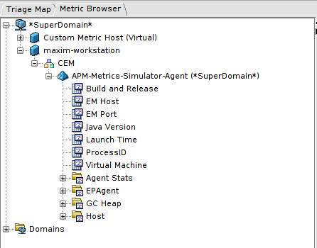
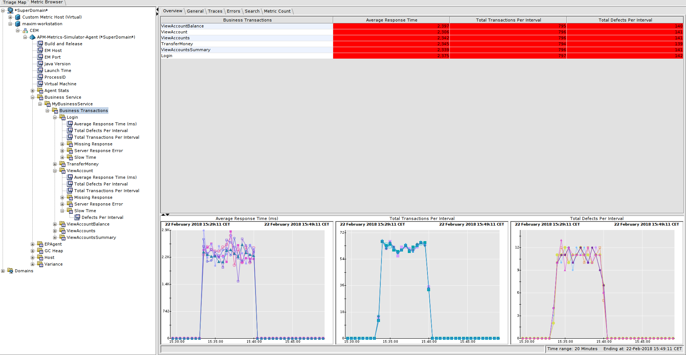

# APM Metrics Simulator

# Description
This project is using CA APM EPAgent built-in /apm/metricFeed REST end-point to report metrics to CA APM Enterprise Manager.
To read up further on this functionality, please consult with official CA APM documentation - https://docops.ca.com/ca-apm/10-5/en/implementing-agents/ep-agent/configure-epagent-to-enterprise-manager-connections/configure-the-epagent-restful-interface


Recently, I was facing with a situation, where I didn't have access to the LIVE APM system and I needed to implement (and test) JS-Scripts and Management Module (e.g.: Dashboards, Alerts, etc.) ASAP (as always). So, I've decided to spend few hours to create something that I could use to simulate metrics needed for the job. I tried to make it as generic as possible, so it can be used/re-used by anybody who doesn't have access to LIVE metrics or if you would prefer to do t he work remotely.

A very special shout out goes to the people behind this project [Dockerized Introscope](https://github.com/CA-APM/docker-introscope) - I followed the simple instructions there to create and run my own CA APM Introscope docker images on my laptop - which made it possible to do the whole development and testing without the need for access for LIVE metrics.
**THANK YOU!**

## Short Description
The APM Metrics Simulator can be deployed and used on any Linux or Mac based system to simulate metrics creation in CA APM Introscope.

## APM Version
So far - this solution was tested with APM 10.5.1 and 10.5.2 installations running on Ubuntu 16.04 LTS.


## Supported third party versions
[Apache JMeter](http://jmeter.apache.org/) is used to drive metrics creation. I've used version 3.3 for my tests.

## Limitations
The current solution doesn't simulate CA APM events - e.g. Transaction Traces, Error Snapshots.

## License
This field pack is provided under the [Eclipse Public License, Version 1.0](LICENSE).
Please review the
**LICENSE**
file in this repository.  Licenses may vary by repository.  Your download and use of this software constitutes your agreement to this license.

# Installation instructions

## Pre-Requisites:
* You have EPAgent binaries - due to CA APM licensing, I can't provide the binaries as part of this repository.
* You have a working CA APM Enterprise Manager that you can access from the machine that will be running EPAgent.
* You have Apache JMeter installed or you have access to a hosted JMeter instance, for example [BlazeMeter](https://www.blazemeter.com/).
  The machine that is running EPAgent should be accessible from the machine that is running Apache JMeter/BlazeMeter.
  *Note: I've tested this solution with Apache JMeter running locally.*

## Installation
1. `git clone <INSERT_github.com repo here>`
2. `cd <dir>`

# Usage Instructions
  * Make sure that your EPAgent is running and you can see it connected and reporting default metrics to the CA APM EM.
    You should see something like this:

    

  * Using Apache JMeter:
    `jmeter -n -t jmeter-scripts/CreateMetricsInAPM.jmx -l \
     output/MyResultFile -e -o output \
     -Japm-epagent-url=127.0.0.1 -Japm-epagent-http-server-port=9090`

     After you started the JMeter test successfully, you should be able to see metrics in your CA APM Workstation or WebView:

     


## Support
This solution is provided "AS-IS" and you may use it at your own risk.
if you think that you found a bug or something is not working - please create an issue under this repository. I'll  try to respond in a timely manner.

# Contributing
Your contribution to this project is appreciated - pull requests are welcomed.

# Trouble Shooting:
1. JMeter reporting errors when trying to access EPAgent /apm/metricFeed Rest End Point.
A good response should look like this:
```
Error Count: 0
Data type ("text"|"bin"|""):
Response code: 200
Response message: OK
```
but we can see a consistence error coming up once a few requests:
```
Sample Count: 1
Error Count: 1
Data type ("text"|"bin"|""): text
Response code: Non HTTP response code: org.apache.http.NoHttpResponseException
Response message: Non HTTP response message: 127.0.0.1:9090 failed to respond
```

That's the exception details from JMeter:

```
org.apache.http.NoHttpResponseException: 127.0.0.1:9090 failed to respond
	at org.apache.http.impl.conn.DefaultHttpResponseParser.parseHead(DefaultHttpResponseParser.java:141)
	at org.apache.http.impl.conn.DefaultHttpResponseParser.parseHead(DefaultHttpResponseParser.java:56)
	at org.apache.http.impl.io.AbstractMessageParser.parse(AbstractMessageParser.java:259)
	at org.apache.http.impl.AbstractHttpClientConnection.receiveResponseHeader(AbstractHttpClientConnection.java:286)
	at org.apache.http.impl.conn.DefaultClientConnection.receiveResponseHeader(DefaultClientConnection.java:257)
	at org.apache.jmeter.protocol.http.sampler.hc.ManagedClientConnectionImpl.receiveResponseHeader(ManagedClientConnectionImpl.java:199)
	at org.apache.jmeter.protocol.http.sampler.MeasuringConnectionManager$MeasuredConnection.receiveResponseHeader(MeasuringConnectionManager.java:212)
	at org.apache.http.protocol.HttpRequestExecutor.doReceiveResponse(HttpRequestExecutor.java:273)
	at org.apache.http.protocol.HttpRequestExecutor.execute(HttpRequestExecutor.java:125)
	at org.apache.http.impl.client.DefaultRequestDirector.tryExecute(DefaultRequestDirector.java:684)
	at org.apache.http.impl.client.DefaultRequestDirector.execute(DefaultRequestDirector.java:486)
	at org.apache.http.impl.client.AbstractHttpClient.doExecute(AbstractHttpClient.java:835)
	at org.apache.http.impl.client.CloseableHttpClient.execute(CloseableHttpClient.java:83)
	at org.apache.jmeter.protocol.http.sampler.HTTPHC4Impl.executeRequest(HTTPHC4Impl.java:695)
	at org.apache.jmeter.protocol.http.sampler.HTTPHC4Impl.sample(HTTPHC4Impl.java:454)
	at org.apache.jmeter.protocol.http.sampler.HTTPSamplerProxy.sample(HTTPSamplerProxy.java:74)
	at org.apache.jmeter.protocol.http.sampler.HTTPSamplerBase.sample(HTTPSamplerBase.java:1189)
	at org.apache.jmeter.protocol.http.sampler.HTTPSamplerBase.sample(HTTPSamplerBase.java:1178)
	at org.apache.jmeter.threads.JMeterThread.executeSamplePackage(JMeterThread.java:498)
	at org.apache.jmeter.threads.JMeterThread.processSampler(JMeterThread.java:424)
	at org.apache.jmeter.threads.JMeterThread.run(JMeterThread.java:255)
	at java.lang.Thread.run(Thread.java:748)
```
It seems that the EPAgent's built-in jetty web server doesn't have enough juice to handle requests that JMeter is firing at it.
I found that beefing up these parameters (normally located at the end of the file) in **IntroscopeEPAgent.properties** file.
```
introscope.epagent.config.HttpServer.minThreadCount=100
introscope.epagent.config.HttpServer.maxThreadCount=200
introscope.epagent.config.HttpServer.maxQueuedCount=1000
introscope.epagent.config.HttpServer.maxIdleTimeMS=18000000
introscope.epagent.config.HttpServer.maxIdleTime=10000
introscope.epagent.config.HttpServer.acceptQueueSize=1000
```

In addition, it will not heart to give a bit more RAM to EPAgent - Edit your EPAService.conf file and add `wrapper.java.additional.2=-Xmx1024m` in the *Additional Java parameters* section.
